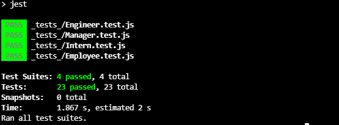
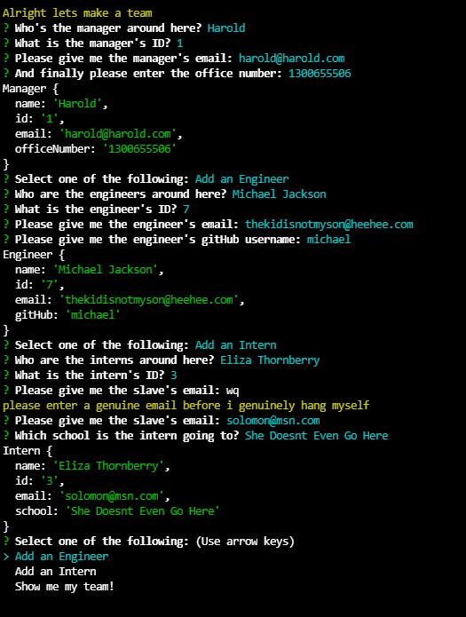
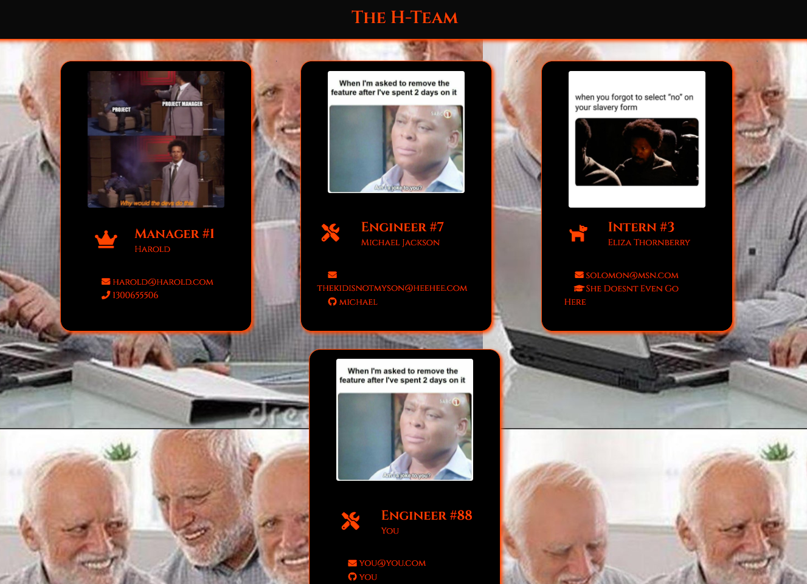

# **
 MoesTeamGenerator 
**

## **Contents**
- [Description](#description)
- [Technologies](#technologies)
- [The Recipe](#the-recipe)
- [License](#license)
- [Shout Outs](#shout-outs)
- [SS + Video](#screen-shots-and-video-walkthrough)

 

## **Description**
Team generator which uses node.js to build a team through user input using the inquirer npm package. 
  
User is first asked to add a manager which is necessary, then can choose to add no/some engineers/interns. For each employee, the user is asked certain questions pertaining to their role (i.e. ID#, email, officenumber for them late night calls, etc). After the user is done adding their employees, they can select to generate their ultimate team.

## **Technologies**
- HTML, CSS, JavaScript, jQuery
- Bulma, FontAwesome
- Node.js
- Inquirer, Jest, Cli-Color

## **The Recipe**
1. Clone this repo to the location of your choice
2. Open your command terminal in the root folder of the repo
3. Run `npm install`
4. Run `npm index.js`
5. Answer the questions
6. File should be generated in the dist folder.
7. Open it and experience what it's like to be my father. Disappointed.

## **License**

MIT License, do what you want.  
The only crime that could possibly be comitted here would be actually using this 'app'

## **Shout Outs**

Shout out to the real MVP, Stack Overflow

## **Screen Shots and Video Walkthrough**

[Video Walkthrough](https://watch.screencastify.com/v/lXX1FtVjvAHd7VgjhlBx)
 

### **Passed Tests**

 
 

### **Questions in Terminal**

 
 

### **The H-Team**
